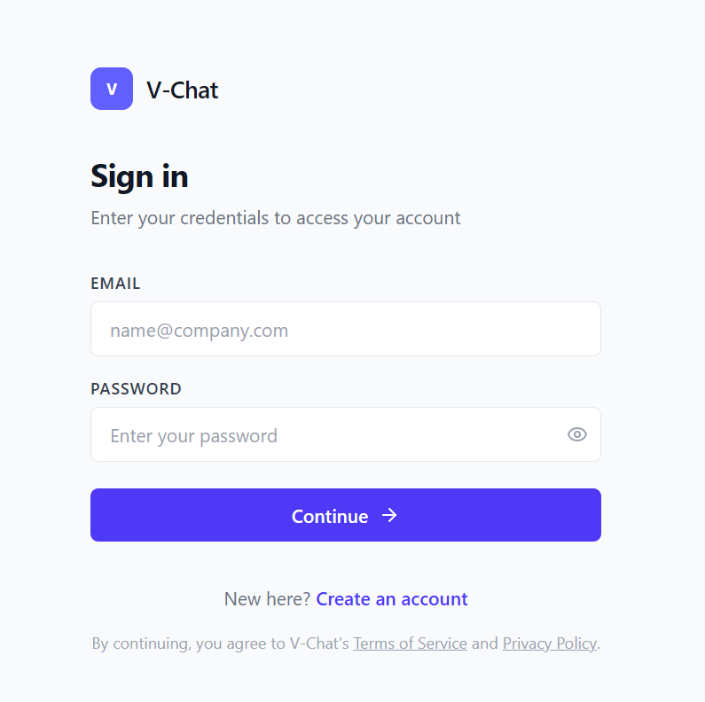
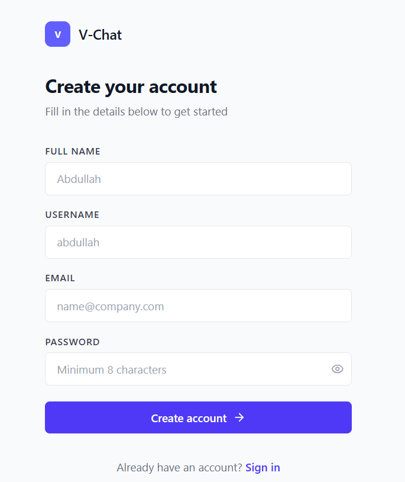
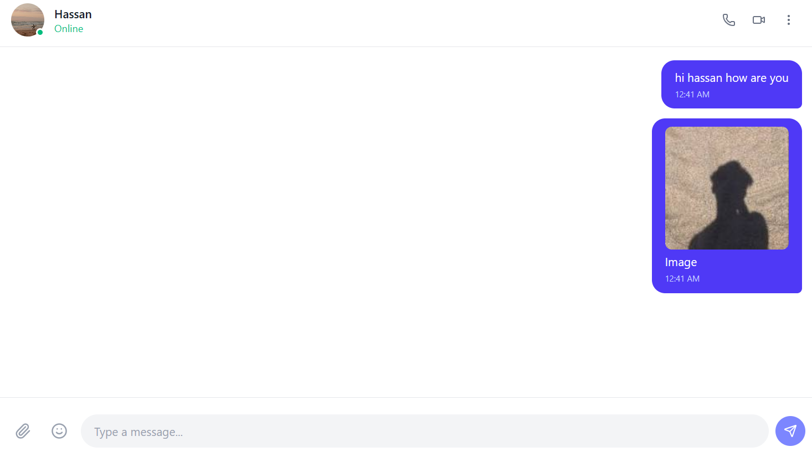
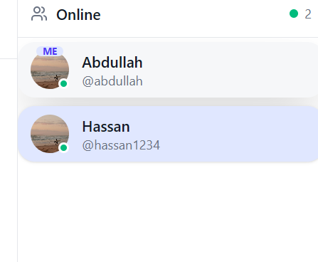

<p align="center">
  
</p>

<h1 align="center">V-Chat</h1>

<p align="center">
  <strong>A real-time messaging platform with authentication, online presence, typing indicators, and image sharing.</strong>
</p>

<p align="center">
  
  
  
  
  
  
  
</p>

---

## Screenshots

<p align="center">
  
  <br />
  <em>Login page with email/password authentication</em>
</p>

<br />

<p align="center">
  
  <br />
  <em>Registration page with fullName, username, email, and password fields</em>
</p>

<br />

<p align="center">
  
  <br />
  <em>Main chat interface with message bubbles and input area</em>
</p>

<br />

<p align="center">
  
  <br />
  <em>Online users sidebar with presence indicators</em>
</p>

## Overview

V-Chat is a full-stack real-time chat application built with a modern JavaScript stack. It provides secure user authentication, one-on-one messaging with live updates, typing indicators, online presence tracking, and image sharing via Cloudinary.

## Features

- **User Authentication** — Register and login with hashed passwords (bcryptjs) and JWT-based session management stored in HTTP-only cookies.
- **Real-Time Messaging** — Instant message delivery powered by Socket.IO with room-based targeting.
- **Typing Indicators** — See when the other person is typing in real time.
- **Online Presence** — Green dot indicators show who's online; updates live as users connect or disconnect.
- **Image Sharing** — Upload and send images with Cloudinary integration via Multer.
- **Chat History** — Persistent message history stored in MongoDB, fetched on conversation open.
- **Responsive Layout** — Two-panel chat interface with an online users sidebar.
- **Password Visibility Toggle** — Eye/eye-off icons on password fields for usability.
- **Protected Routes** — Chat endpoints and pages require a valid JWT token.

## Tech Stack

| Layer | Technology |
|-------|-----------|
| **Frontend** | React 19, Vite 8, Tailwind CSS 4, React Router 7, Axios, Socket.IO Client |
| **Backend** | Node.js, Express 5, Socket.IO 4, Mongoose 9, JWT, bcryptjs |
| **Database** | MongoDB |
| **File Storage** | Cloudinary (via Multer) |
| **Icons** | Lucide React |

## Architecture

```
v-chat/
├── assets/                    # Screenshots and media
├── client/                    # React frontend (Vite)
│   └── src/
│       ├── components/
│       │   ├── Pages/         # Chat, Login, Signup
│       │   ├── Contexts/      # CurrUserContext (auth state)
│       │   └── OnlineUsers.jsx
│       └── App.jsx            # Router setup
│
├── server/                    # Express + Socket.IO backend
│   ├── src/
│   │   ├── Controllers/       # user.controller, chat.controller
│   │   ├── Routes/            # user.routes, chat.routes
│   │   ├── Models/            # User, Chat (Mongoose schemas)
│   │   ├── Middlewares/       # JWT auth, Multer upload
│   │   ├── Utils/             # JWT token generation
│   │   └── db/                # MongoDB connection
│   ├── server.js              # HTTP + Socket.IO entry point
│   └── socket.js              # Socket event handlers
│
└── readme.md
```

## Getting Started

### Prerequisites

- Node.js >= 18
- MongoDB (local instance or Atlas URI)
- A Cloudinary account (for image uploads)

### Installation

1. **Clone the repository**

   ```bash
   git clone https://github.com/mabdullah356/v-chat.git
   cd v-chat
   ```

2. **Install client dependencies**

   ```bash
   cd client
   npm install
   ```

3. **Install server dependencies**

   ```bash
   cd ../server
   npm install
   ```

4. **Configure environment variables**

   Create a `.env` file in the `server/` directory:

   ```env
   PORT=3000
   DB_URL=mongodb://localhost:27017/v-chat
   JWT_SECRET=your_jwt_secret_here
   JWT_EXP=7d

   CLOUD_NAME=your_cloudinary_cloud_name
   CLOUD_API_KEY=your_cloudinary_api_key
   CLOUD_API_SECRET=your_cloudinary_api_secret
   ```

5. **Start MongoDB**

   Ensure your local MongoDB instance is running, or point `DB_URL` to your MongoDB Atlas URI.

6. **Run the application**

   Start the server:

   ```bash
   cd server
   node server.js
   ```

   In a separate terminal, start the client dev server:

   ```bash
   cd client
   npm run dev
   ```

7. **Open the app**

   Navigate to `http://localhost:5173` in your browser.

### Running with a single command (optional)

Install `concurrently` at the root level or use a root `package.json`:

```json
{
  "scripts": {
    "dev": "concurrently \"npm run dev --prefix client\" \"node server/server.js\"",
    "build": "npm run build --prefix client"
  }
}
```

## API Reference

### Authentication

| Method | Endpoint | Description |
|--------|----------|-------------|
| POST | `/api/users/register` | Create a new account |
| POST | `/api/users/login` | Log in with email and password |
| POST | `/api/users/logout` | Clear authentication cookie |

### Chat

All chat endpoints require JWT authentication (cookie).

| Method | Endpoint | Description |
|--------|----------|-------------|
| POST | `/api/chats` | Send a message (multipart/form-data with optional image) |
| GET | `/api/chats/:username` | Get message history with a specific user |

### WebSocket Events

| Event | Direction | Payload | Description |
|-------|-----------|---------|-------------|
| `join` | Client → Server | `{ userId }` | Join the socket room for messaging |
| `send-message` | Client → Server | `{ receiverId, message, type, fileUrl }` | Send a real-time message |
| `receive-message` | Server → Client | `{ sender, message, ... }` | Receive a real-time message |
| `typing` | Client → Server | `{ receiverId }` | Notify that the user is typing |
| `stop-typing` | Client → Server | `{ receiverId }` | Notify that the user stopped typing |
| `online-users` | Server → Client | `[ { userId, username, ... } ]` | List of currently online users |

## Data Models

### User

| Field | Type | Description |
|-------|------|-------------|
| fullName | String | Display name |
| username | String | Unique, lowercase handle |
| email | String | Unique, lowercase email |
| password | String | bcrypt-hashed |
| avatar | String | Profile image URL (default from Unsplash) |
| isOnline | Boolean | Online status |
| isTyping | Boolean | Typing indicator |
| socketId | String | Active Socket.IO connection ID |
| timestamps | Date | createdAt, updatedAt |

### Chat (Message)

| Field | Type | Description |
|-------|------|-------------|
| sender | ObjectId | Ref → User |
| receiver | ObjectId | Ref → User |
| type | Enum | `text`, `image`, `video`, `audio` |
| message | String | Message content |
| fileUrl | String | Cloudinary URL for media attachments |
| timestamps | Date | createdAt, updatedAt |

## Scripts

### Client

| Script | Command | Description |
|--------|---------|-------------|
| `dev` | `vite` | Start development server on port 5173 |
| `build` | `vite build` | Build for production |
| `preview` | `vite preview` | Preview production build locally |
| `lint` | `eslint .` | Run ESLint across the codebase |

### Server

| Script | Command | Description |
|--------|---------|-------------|
| `start` | `node server.js` | Start the production server |

## Project Status

V-Chat is actively developed. Current areas for improvement:

- [ ] Add automated tests (unit + integration)
- [ ] Add end-to-end testing
- [ ] Implement group chat functionality
- [ ] Add message read receipts
- [ ] Support voice messages and video calls
- [ ] Add message search and pagination
- [ ] Improve mobile responsiveness
- [ ] Set up CI/CD pipeline
- [ ] Containerize with Docker
- [ ] Add rate limiting and request validation

## License


---

<p align="center">
  Muhammad Abdullah ❤
</p>
